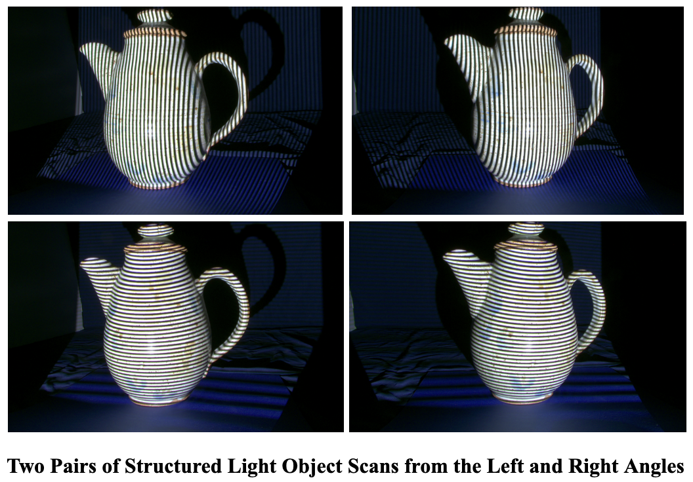

# 3D-Scanner
This is a 3D Scanner that uses images of an object to triangulate a point cloud, form a mesh, and construct a model.

This code applies structured light scanning. In this case objects must be projected with vertical and horizonal bars of light of varying degrees and images must be taken from the left and right angles consistently to achieve the image format necessary for this process.

