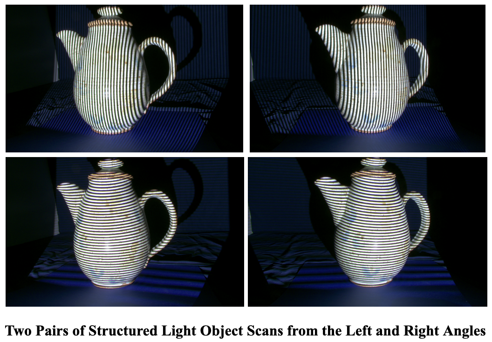
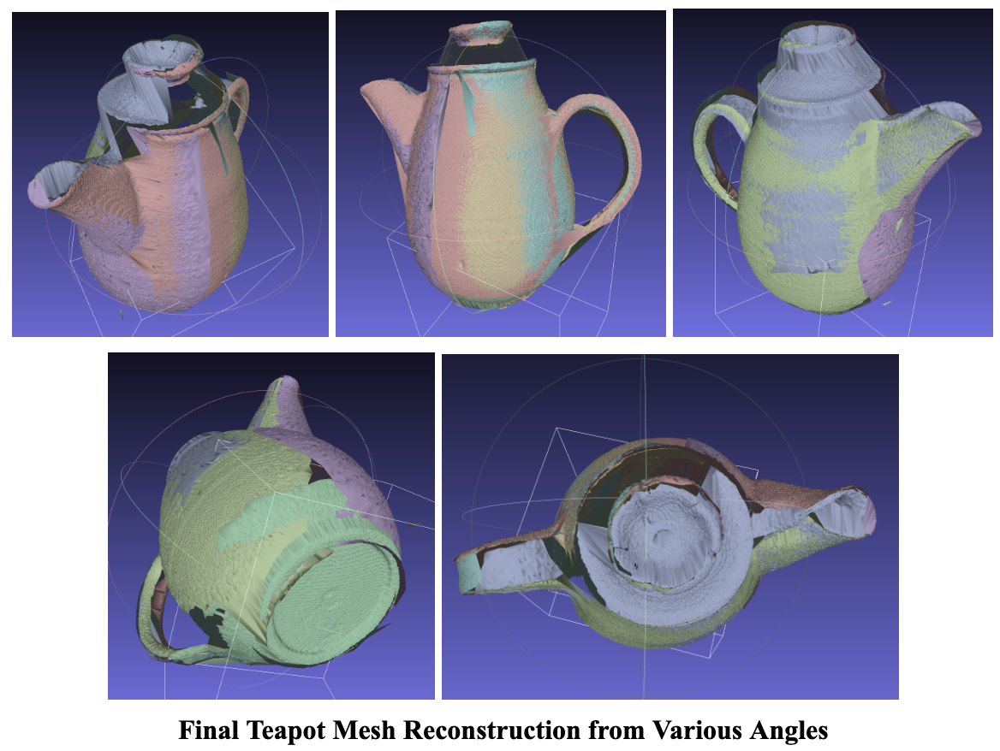

# 3D-Scanner
This is a 3D Scanner written in Python that uses images of an object to triangulate a point cloud, form a mesh, and construct a model.

This code applies structured light scanning. In this case objects must be projected with vertical and horizonal bars of light of varying degrees and images must be taken from the left and right angles consistently to achieve the image format necessary for this process.

The code will produce several meshes that can be organized in MeshLab to produce the final model. MeshLab allows you to modify the meshes to clean up the final model. 

